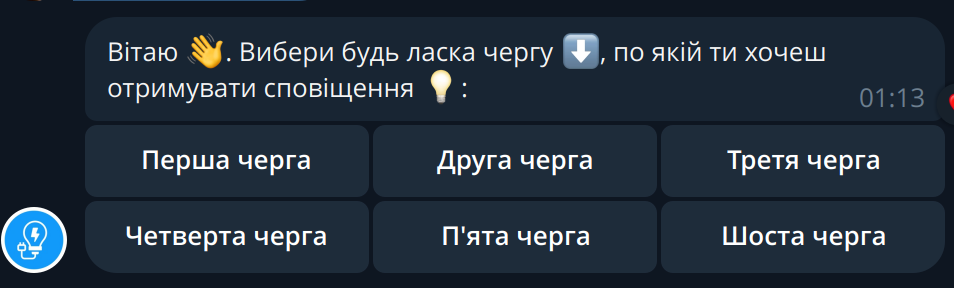
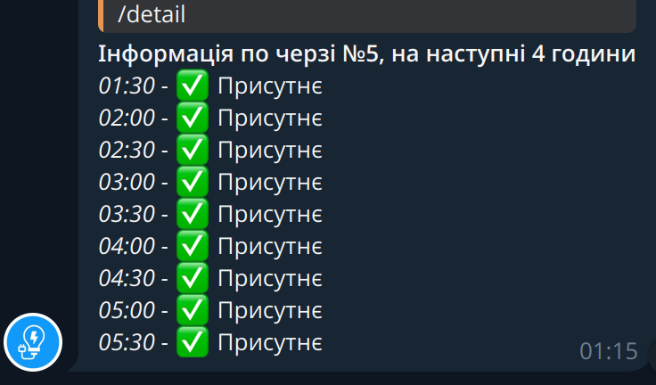

## **Warning**

Project currently not running and just in development mode

Energy bot to work with different energy providers

- poe
- energy_ua (old-version)

## Prerequisites

Clone project to the /opt folder
Create virtual environment in the /opt/e-energy folder

In the /opt/e-energy folder create virtual environment and activate it

```
sudo apt install python3.13-venv
python3 -m venv venv
source venv/bin/activate
```

After activation run the install.sh script

```
sh install.sh
```

## Bot configuration


Edit .env file

```
BOT_TOKEN=token
ADMIN_CHAT_ID=adminid
TIMEOUT=15
TURN_ON_NOTIFY=True
PROVIDER=
PROVIDER_URL=
```

## Bot messages and command

### Main bot commands

`/start` - show start information to user with list of queues in database, user can subscribe to some queue notify using this command


`/remove` - remove notify by queue, show current queue subscribes

`/all` - show all information about day energy on\off schedule


`/detail` - show detail info (like in energy provider table)

...

### Messages

All base messages described here:
[messages.py](energybot/helpers/messages.py).

This messages using to send some information to user \ or make notifications

## Contributing

- Fork the repository.
- Create a new branch (git checkout -b feature-branch).
- Commit your changes (git commit -am 'Add some feature').
- Push to the branch (git push origin feature-branch).
- Create a new Pull Request.
