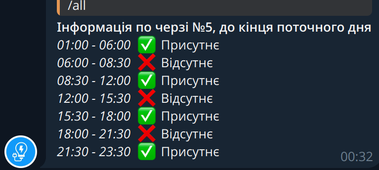

> **Warning**
> Project currently not running and just in development mode


Energy bot to work with differents energy providers
- poe
- energy_ua (old-version)
## Simple installation via **pypip**

```
pip install energybot
```


## Bot configuration

Create .env file
```
BOT_TOKEN=token
ADMIN_CHAT_ID=adminid
TIMEOUT=15
TURN_ON_NOTIFY=True
PROVIDER=
PROVIDER_URL=
```

Run **bot** as service for pooling

Loggin as root to the VM:
  `systemctl edit --force --full energybot.service`

create this unit:
```
[Unit]
Description=E-Energy Bot Service
Wants=network.target
After=network.target

[Service]
WorkingDirectory=/opt/e-energy
ExecStartPre=/bin/sleep 1
ExecStart=/opt/e-energy/venv/bin/energybot
Restart=always

[Install]
WantedBy=multi-user.target

```
Eneable service:
`systemctl enable energybot.service`
Check status:
`systemctl status energybot.service`
Start if needed:

```
systemctl start energybot.service
```

Run worker to process notification and sync to synchronize information about energy schedule, using cron: `crontab -e`
```
*/30 * * * * cd /opt/e-energy/ && venv/bin/energybot --run sync # e-energy sync service
*/15 * * * * cd /opt/e-energy/ && venv/bin/energybot --run worker # e-energy worker service
```

## Energy providers configuration

**You can add own energy provider**

- create energy provider worker in providers folder for example **poe.py**
- this provider must contains two function:
  - **get_queue_info()** - for get current info about queue
  - **print_queue_info()** for output info about queue to console (for debugging) 
- provider must use load_data() and save_data() function for bot working correctly with other modules
- you can use html parce to get info about queue and output this data to dict format like:
```
specific_datetime = {
  'text': 'OFF/ON',
  'id':n,
  'value': False/True
}
```


## Bot messages and command


### Main bot commands
`/start` - show start information to user with list of queues in database, user can subscribe to some queue notify using this command


`/remove` - remove notify by queue, show current queue subscribes

`/all` - show all information about day energy on\off schedule


`/detail` - show detail info (like in energy provider table)

...

### Messages

All base messages described here:
[messages.py](energybot/helpers/messages.py).

This messages using to send some information to user \ or make notifications


## Contributing
- Fork the repository.
- Create a new branch (git checkout -b feature-branch).
- Commit your changes (git commit -am 'Add some feature').
- Push to the branch (git push origin feature-branch).
- Create a new Pull Request.
